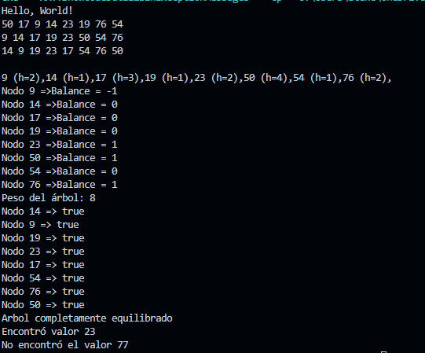

# BinaryTree - Árbol Binario en Java

Este proyecto implementa un Árbol Binario de Búsqueda (ABB) con diversas funciones útiles para el aprendizaje de estructuras de datos.

## 📦 Estructura

- `App.java`: Clase principal donde se insertan nodos y se ejecutan las funcionalidades del árbol.
- `BinaryTree.java`: Lógica del árbol binario, incluyendo inserciones, recorridos, altura, balance, y peso.
- `Node.java`: Clase auxiliar que representa un nodo del árbol (debes definirla si aún no la tienes).

## 🚀 Funcionalidades

- Inserción de nodos con `insert(int value)`
- Recorridos del árbol:
  - Preorden, Inorden, Postorden
  - Impresión con altura de cada nodo
- Búsqueda de un valor con `findeValue(int valor)`
- Altura del árbol con `getHeightTree()`
- Peso del árbol (número de nodos) con `getPesoDelArbol()`
- Balance de cada nodo con `imprimirBalanceDeCadaNodo()`
- Verificación de equilibrio paso a paso con mensajes detallados

## 🔍 Ejemplo de ejecución

```text
Hello, World!
9 14 17 19 23 50 54 76
9 (h=1),14 (h=2),17 (h=1),19 (h=3),23 (h=2),50 (h=4),54 (h=1),76 (h=2)
Nodo 9 =>Balance = 0
Nodo 14 =>Balance = 1
...
Peso del árbol: 8
Nodo 9 => true
Nodo 14 => true
Nodo 50 => false desde el nodo 50
Arbol desequilibrado
Encontró valor 23
No encontró el valor 77
