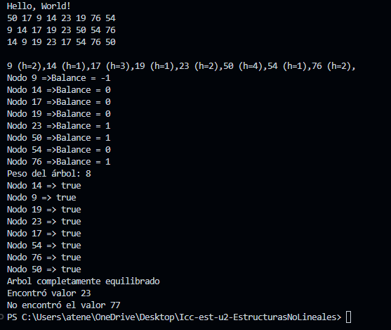

# 🌳 BinaryTree - Árbol Binario de Búsqueda en Java

Este proyecto implementa un **Árbol Binario de Búsqueda (ABB)** para apoyar el aprendizaje de estructuras de datos, mostrando cómo manipular árboles con métodos básicos y avanzados.

## 📁 Estructura del Proyecto

- `App.java`: Punto de entrada. Permite insertar nodos y ejecutar funcionalidades del árbol.
- `BinaryTree.java`: Lógica del ABB: inserción, recorridos, altura, peso, y balance.
- `Node.java`: Representación de cada nodo del árbol con valor, hijos, y opcionalmente su altura.

## 🚀 Funcionalidades

- `insert(int value)`: Inserta un nuevo nodo manteniendo el orden del ABB.
- Recorridos del árbol:
  - `preOrden()` → Nodo → Izquierda → Derecha
  - `inOrden()` → Izquierda → Nodo → Derecha (valores ordenados)
  - `postOrden()` → Izquierda → Derecha → Nodo
  - Impresión con altura de cada nodo
- `findeValue(int valor)`: Busca si un valor existe dentro del árbol
- `getHeightTree()`: Devuelve la altura total del árbol
- `getPesoDelArbol()`: Cuenta el número total de nodos
- `imprimirBalanceDeCadaNodo()`: Imprime el balance de cada nodo (`altura izquierda - derecha`)
- Verificación de equilibrio paso a paso con mensajes detallados

## 🧪 Ejemplo de Ejecución


```text
Hello, World!
9 14 17 19 23 50 54 76          ← inOrden
9(h=1),14(h=2),17(h=1),...      ← Alturas de cada nodo
Nodo 14 => Balance = 1          ← Balance de nodos
...
Peso del árbol: 8
Nodo 9 => true
Nodo 50 => false desde el nodo 50
Árbol desequilibrado
Encontró valor 23
No encontró el valor 77
